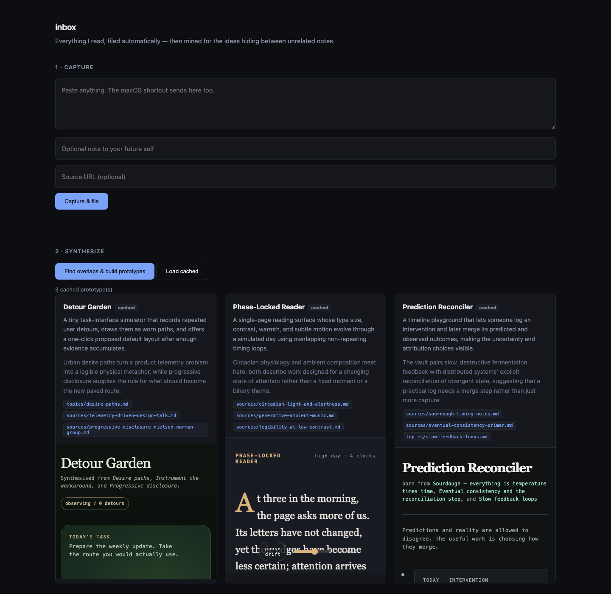
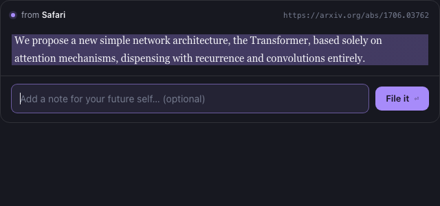

# inbox



**Everyone has the same models. The only durable edge is context.**

`inbox` captures what you read, files it automatically into a plain-markdown
knowledge vault, and then mines that vault for the ideas hiding *between*
unrelated notes — spinning up a sandbox per idea that builds a working prototype
you can click.

Built for the Daytona hacksprint. The agent doing the filing and the building is
the **Codex CLI**, running inside **Daytona** sandboxes.

---

## The three layers

| Layer | What happens |
| --- | --- |
| **1 · Capture** | Highlight text anywhere on macOS, press ⌘⇧K. A floating HUD shows what you grabbed, takes an optional note, and files it. It lands in the vault's `inbox/`. |
| **2 · File** | Codex, in a sandbox holding the vault, reads the filing ruleset, greps for near-duplicates, decides route + filename + frontmatter + links, writes the note and commits. **No confirmation step.** |
| **3 · Synthesize** | Codex reads the whole vault, finds cross-domain overlaps, proposes ideas that cite the exact notes they came from — then N sandboxes each build a live prototype, rendered as iframes. |

Layer 3 is the point. Layers 1 and 2 exist to make its input real.

---

## Run it yourself

```bash
git clone https://github.com/giuulio/daytona-hacksprint
cd daytona-hacksprint
cp .env.example .env          # add DAYTONA_API_KEY
npm install
npm run snapshot              # build the warm Daytona snapshot (~90s, once)
npm run dev                   # http://localhost:3737
```

**Codex auth** — two supported modes, neither ever baked into the snapshot:

- **ChatGPT subscription** (what this was demoed on): `codex login` on your
  machine, and `~/.codex/auth.json` is uploaded into each sandbox at runtime.
- **API key**: set `OPENAI_API_KEY` in `.env`, passed as an env var at
  `create()` time.

Point `vault/` at your own markdown notes, or use the seeded one included here.

**The capture HUD:**



```bash
npm run hud     # registers ⌘⇧K globally, runs as a background agent
```

Highlight text in any app, press ⌘⇧K. The HUD shows the selection, the source
app and URL, and takes an optional note. ⏎ files it, esc dismisses. Your
clipboard is restored afterwards.

The window appears in **~2ms** and the selection resolves in **~200-420ms**.
Getting there needed three fixes worth knowing about if you build something
similar: the first `clipboard.readText()` after idle costs 500-1800ms (a cold
pasteboard wake), so a timer keeps it warm; `showInactive()` puts the window up
without stealing focus, so ⌘C still reaches the app you were reading; and the
source app/URL lookup is deferred until after the window is already visible.

macOS will ask for **Accessibility** permission the first time — the HUD sends
⌘C to grab the selection, which is more reliable across apps (browsers, PDFs,
native apps) than reading the accessibility selection directly. The permission
dialog names *Electron*, not *inbox*, because this is an unsigned dev build.

A no-Electron fallback exists as a macOS Quick Action:
`./scripts/install-shortcut.sh`, then bind it under System Settings → Keyboard
→ Keyboard Shortcuts → Services.

---

## How Daytona is used

Two distinct roles, both load-bearing at demo time:

- **Vault sandbox** — long-lived, holds the markdown vault as a real git repo.
  Codex gets a *shell*, `git` and `ripgrep`. That matters: deciding whether a
  captured link should become a new note or join an existing hub note depends
  on the current state of the entire repo. That is a filesystem question, not
  an API question, so the agent needs a machine.
  Progress is streamed to the browser over SSE, so the ideas and their citations
  render ~40s before the prototypes finish rather than behind a two-minute spinner.
- **Prototype sandboxes** — ephemeral, one per generated idea, created in
  parallel from a warm snapshot. Each runs Codex to write a single
  self-contained `index.html`, serves it on port 3000, and returns a preview URL
  that the UI embeds directly in an iframe. Created with `public: true`, short
  `autoStopInterval`, and `autoDeleteInterval` so they clean themselves up.

## Why sandboxing is the right architecture, not a checkbox

The vault contains text copied off the open internet, and that text is fed to an
agent that writes and executes code. **That is untrusted input producing
executable output** — the textbook prompt-injection surface. Isolating it in a
disposable machine with a short TTL is the correct design, and it would be the
correct design even if Daytona weren't the sponsor.

The isolation is also what makes the fan-out cheap enough to be wasteful with:
three sandboxes per synthesis run, deleted minutes later.

---

## Numbers

Instrumented from the first sandbox onward — see `metrics.jsonl`.

| | |
| --- | --- |
| Snapshot build (once) | 88s |
| Sandbox cold start, p50 | **1.1s** |
| Prototype sandbox create, p50 | 0.8s |
| Capture → filed, committed, synced to disk | 32s |
| Vault sync back to disk | 0.2s |
| HUD window on screen | **~2ms** |
| HUD selection resolved | 200-420ms |
| Synthesis (vault → 3 cited ideas) | 40s |
| **Capture → live prototype URL, p50** | **54s** |
| Full 3-way fan-out, end to end | 117s (3/3 live) |
| Sandboxes created while building this | 11 |

---

## Invariants

Enforced in server code, not just in prompts:

1. `ideas/raw/` is never written to — any agent write there is reverted before
   commit ([`src/capture.ts`](src/capture.ts)).
2. Every proposed idea's citations are checked against `git ls-files`;
   hallucinated paths are dropped ([`src/synth.ts`](src/synth.ts)).
3. One failing prototype sandbox never blanks the grid — `Promise.allSettled`,
   with cached prototypes as the fallback render.
4. Secrets never enter the repo, the browser, or a snapshot.

---

## Honest limitations

- **Filing is single-shot.** Codex gets one pass with no verification loop. It
  is right most of the time, and when it is wrong there is no review step —
  by design, but it means the vault needs occasional weeding.
- **Synthesis quality depends on vault size.** With 25 notes it finds real
  overlaps; the seeded vault has three planted deliberately. A vault of 5 notes
  would produce generic ideas.
- **Prototypes are one HTML file, capped at ~300 lines.** They are demos of an
  idea, not applications. Anything needing a package manager was out of scope.
- **ChatGPT-subscription auth means uploading `auth.json`** — a full-account
  credential — into sandboxes. Acceptable for a hackathon on your own account;
  an API key scoped to one project is the right call for anything real.
- **Daytona tier caps concurrency.** Sandboxes are 2GiB so vault + 3 prototypes
  fit under a 10GiB account limit. Bigger fan-out needs a higher tier.
- **The HUD needs Accessibility permission** and only reads the *current
  selection* — there is no persistent screen reading of any kind.
- **No tests, no CI, no auth, no multi-user.** Deliberately.

## Roadmap

Public, forkable vaults — so the thing you get when you clone someone's repo is
not just their code but the reading that produced it.
